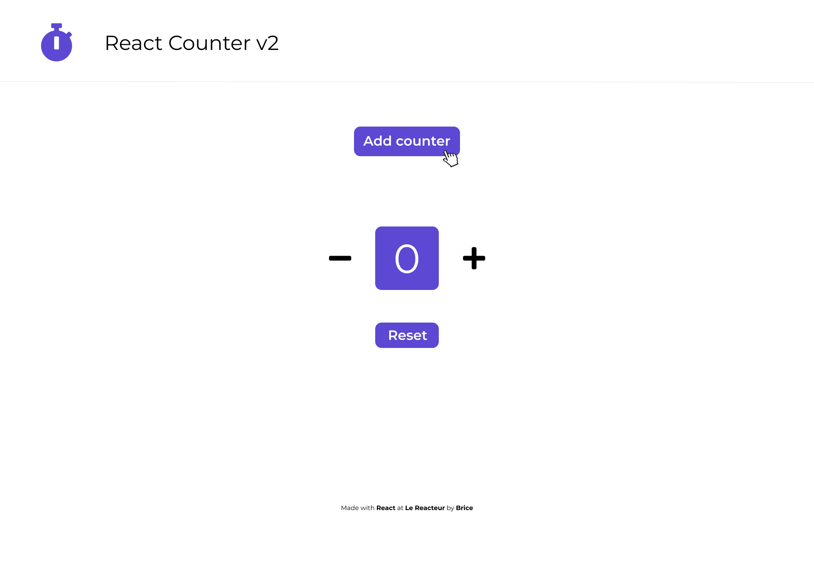
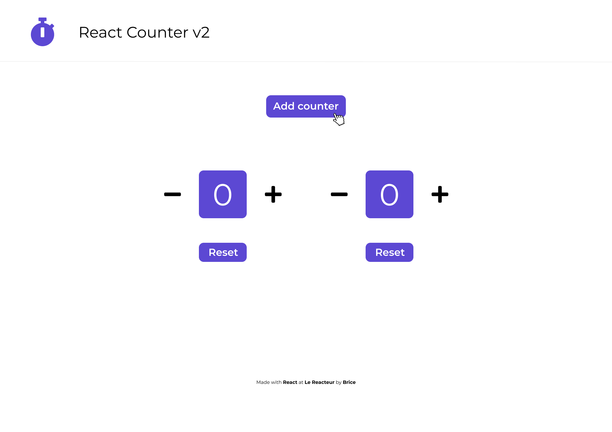
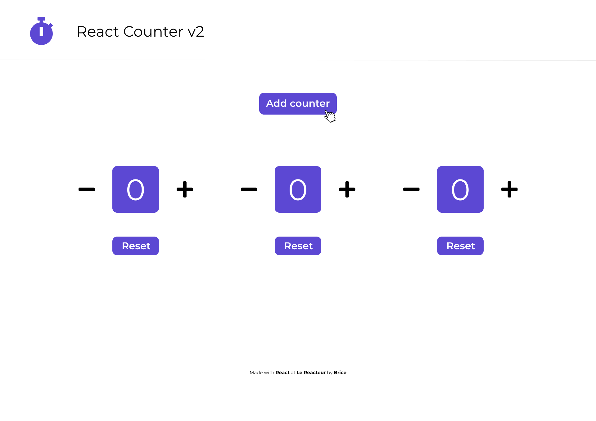

# React Counter v2

Site déployé ➡️ [React Counter v2](https://antancelin-react-counter-v2.netlify.app)

Vous devrez créer un composant **'Counter'** comprenant :

- un compteur avec un bouton +, un bouton - et le résultat
- un bouton **'Reset'** pour remettre le compteur à zéro

 

Au clic sur **'Add Counter'**, un nouveau composant **'Counter'** devra apparaître.

Vous limiterez le nombre de compteurs à 3. Le bouton **'Add Counter'** devra disparaître.

Les compteurs seront bien sûr indépendants.

⚠️ Vous n'avez le droit qu'à un seul state pour cet exercice. Vous ne pouvez pas avoir de second state dans un composant **'Counter'**!

 

 

 

## Bonus

- Faire disparaître le - quand le compteur affiche 0
- Faire disparaître le + quand le compteur affiche 10
- Rendre le projet **responsive**
